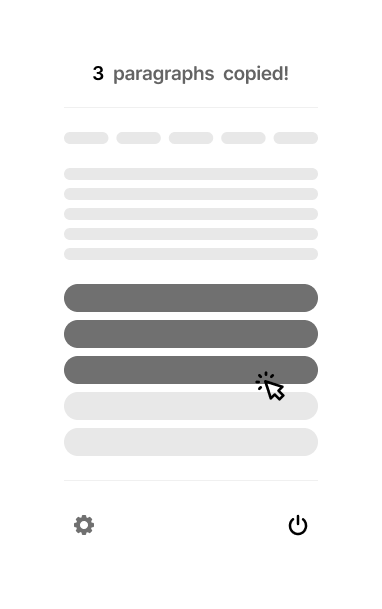
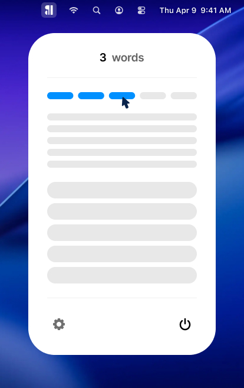
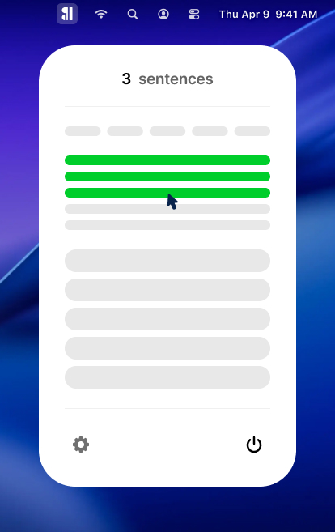
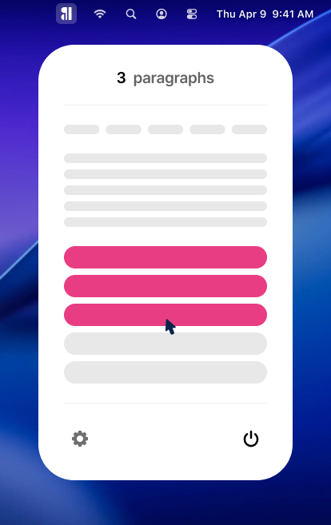

# BetterIpsum

A macOS menu bar app for generating placeholder text — words, sentences, or paragraphs — across themed content categories. Click the menu bar icon, hover to choose an amount, click to copy.

 



## Features

- **Instant copy** — hover over the capsule UI to select a count (1–5), click to copy to clipboard
- **Three content units** — Words, Sentences, and Paragraphs, each with its own visual section
- **Seven themes** — Culinary Literature, Machine Learning Whitepaper, Marketing Copywriting, Scientific Manuscripts, Corporate Finance, Travel Brochures, Fantasy Quest
- **Launch at login** — optional, toggled in Preferences
- **No Dock icon** — lives entirely in the menu bar
- **No network requests** — all content is bundled locally in `themes.json`

## Screenshots


| Words                                 | Sentences                                     | Paragraphs                                      |
| ------------------------------------- | --------------------------------------------- | ----------------------------------------------- |
|  |  |  |


## Requirements

- macOS 15.6 or later
- Xcode 16 or later
- [XcodeGen](https://github.com/yonaskolb/XcodeGen)

## Quick Start

```bash
# Install XcodeGen if you don't have it
brew install xcodegen

# Clone and generate the project
git clone https://github.com/waynedahlberg/better-ipsum.git
cd better-ipsum
xcodegen generate
open BetterIpsum.xcodeproj
```

Build and run (`⌘R`). The app appears in your menu bar — no Dock icon.

> **Note:** `BetterIpsum.xcodeproj` is git-ignored and generated locally. Never edit it directly — change `project.yml` and re-run `xcodegen generate`.

## Project Structure

```
BetterIpsum/
├── project.yml                  ← XcodeGen config (single source of truth)
├── BetterIpsum/
│   ├── BetterIpsumApp.swift     ← App entry, MenuBarExtra
│   ├── Models/
│   │   └── IpsumTheme.swift     ← Codable theme model
│   ├── Services/
│   │   └── IpsumGeneratorService.swift  ← Theme loading, clipboard, login item
│   ├── Views/
│   │   ├── MainPopoverView.swift ← Primary UI with word/sentence/paragraph sections
│   │   ├── PreferencesView.swift ← Theme picker, launch at login toggle
│   │   ├── IpsumBarView.swift
│   │   └── ContentView.swift
│   └── Resources/
│       └── themes.json          ← All placeholder content (bundled, no network)
└── screenshots/
```

## Adding a Theme

All themes live in `BetterIpsum/Resources/themes.json`. Each theme follows this shape:

```json
{
  "id": "unique-kebab-id",
  "name": "Display Name",
  "paragraphs": [
    "Paragraph one...",
    "Paragraph two..."
  ]
}
```

Add your entry to the `themes` array and rebuild — no code changes required.

## Architecture

- `**@Observable` + `MenuBarExtra**` — SwiftUI throughout, targeting macOS 15.6+
- `**IpsumGeneratorService**` — single `@Observable` class injected via `.environment()`, owns all state
- `**SMAppService**` — launch at login via `ServiceManagement`, no helper bundle required
- **No SPM packages** — zero external dependencies

## Contributing

1. Fork the repo
2. `xcodegen generate`
3. Make changes — add themes, fix bugs, improve UI
4. Open a pull request

Please keep PRs focused. One thing per PR.

## License

MIT. See [LICENSE](LICENSE).